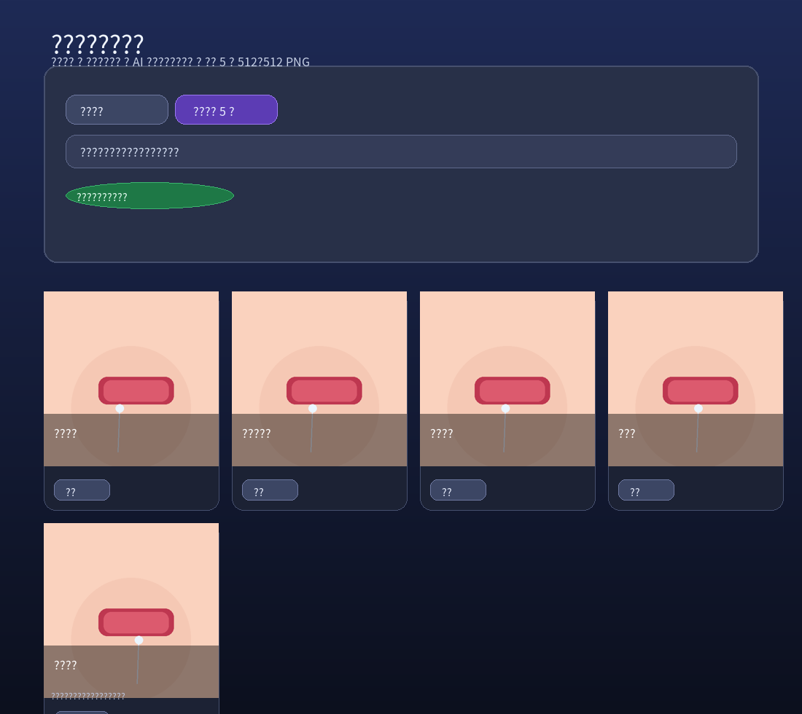

# baby-emoji-generator-web（宝宝表情包生成器）

一键上传 1~多张宝宝照片，自动挑选特写部位并生成 5 张 512×512 微信风格表情包 PNG（裁剪 + 配文 + 渲染），可直接预览与下载（支持 ZIP 一键打包下载）。

## 功能概览

- 功能示意图：



- 只需上传照片：无额外必填输入
- 固定输出 5 张：`512×512`、PNG
- 支持多张照片：自动挑选更清晰/更有特点的特写部位（含嘴巴特写候选）
- 一键下载：返回 ZIP 打包（含 5 张 PNG）
- AI 只做规划：表情语义、裁剪方案、配文生成、安全审查与回退决策
- 程序渲染：Pillow 负责裁剪与加字（白字黑描边、自动换行）
- 可选提示词：用于微调风格/语气（不合规会自动忽略）
- 配文对齐特写：基于“最终裁剪后的特写”二次生成配文（更贴合最终画面）
- 稳定性优先：AI 输出不稳时自动回退，仍固定产出 5 张

## 快速启动（Windows / PowerShell）

在项目根目录执行：

```powershell
python -m venv backend\.venv
backend\.venv\Scripts\python -m pip install -r backend\requirements.txt

# 确保根目录存在 .env（参考 .env.example），并配置 OPENROUTER_API_KEY
backend\.venv\Scripts\python -m uvicorn app.main:app --app-dir backend --reload --host 0.0.0.0 --port 8000
```

打开：`http://127.0.0.1:8000`

也可以使用脚本（会自动安装依赖并启动）：

- `.\start.ps1 -Port 8000`
- 或 `start.bat 8000`

## Docker 启动

```bash
docker compose up --build
```

## 项目结构

```
.
├─ backend/
│  ├─ app/
│  │  ├─ main.py                      # /upload & 静态资源挂载
│  │  ├─ config.py                    # 环境变量/路径配置
│  │  ├─ schemas.py                   # AI JSON 校验（Pydantic）
│  │  ├─ ai/
│  │  │  ├─ openrouter_client.py      # OpenRouter 调用（规划+二次配文）
│  │  │  ├─ system_prompt.txt         # “裁剪+表情+初稿配文”提示词
│  │  │  ├─ response_schema.json      # 规划 JSON Schema
│  │  │  ├─ captions_prompt.txt       # “基于最终特写拼图生成配文”提示词
│  │  │  └─ captions_schema.json      # 配文 JSON Schema
│  │  └─ processing/
│  │     ├─ meme_generator.py         # 裁剪/嘴巴特写定位/拼图/渲染
│  │     ├─ safety.py                 # 提示词/文案合规过滤
│  │     ├─ captions_fallback.py      # 兜底文案库（含嘴巴特写兜底）
│  │     └─ utils.py                  # JSON 提取与修复
│  ├─ assets/fonts/NotoSansSC-Regular.otf
│  ├─ generated/                      # 输出目录（静态挂载 /generated）
│  └─ requirements.txt
├─ frontend/
│  ├─ index.html                      # 上传页（含预览/提示词输入）
│  ├─ app.js                          # 调用 /upload + 展示 5 张 + 下载
│  └─ styles.css
├─ scripts/openrouter_example.py
├─ start.ps1
├─ start.bat
├─ Dockerfile
├─ docker-compose.yml
├─ .env.example
└─ .gitignore
```

## 全自动流程（单次 /upload）

1. 前端 `POST /upload`：上传图片 + 可选 `prompt`
2. 后端读取图片并纠正 EXIF 方向
3. AI 规划（OpenRouter / `openai/gpt-5.2`）输出严格 JSON：
   - 表情语义（用于选择兜底文案类别）
   - 裁剪方案（相对坐标 crop box）
   - 初稿配文（可用但不一定贴合最终特写）
   - 安全审查与回退建议
4. Pillow 程序裁剪与输出 5 张 `512×512` 特写
   - 未提供 box 或 box 异常：自动特征聚焦裁剪
   - “只要嘴巴特写”：启发式唇色定位嘴巴，避免裁到围兜/衣服
5.（增强）配文二次对齐最终特写：
   - 将 5 张最终特写拼成一张“拼图”，再调用 AI 只生成与最终特写一致的 5 条配文
6. Pillow 将配文渲染到 5 张图上并保存到 `backend/generated/`
7. 返回 JSON：图片 URL、是否回退、配文是否对齐最终特写等

## /upload 接口

`POST /upload`（multipart）

- `file`：图片文件（必填；支持多张，前端会以同名字段重复上传）
- `prompt`：可选提示词（最长 240 字；仅用于风格/语气；不合规会忽略）

返回（部分字段）：

- `mode`：`single` / `multi`
- `download_url`：ZIP 打包下载地址
- `results`：固定 5 个，包含 `caption` 与 `url`
- `captions_aligned_to_crops`：是否“配文对齐最终特写”
- `captions_source`：`ai_crops` / `ai_original` / `mouth_fallback` / `fallback`

### 多照片模式说明

当一次上传多张照片时（`mode=multi`）：

- 后端会对每张照片生成“人脸特写候选 + 嘴巴特写候选”，按清晰度/曝光/细节等做启发式打分
- 自动挑选 5 张最合适的特写组成同一套表情包（默认会尽量覆盖不同照片；嘴巴特写默认最多占 2 张）
- 若提示词明确“只要嘴巴特写/嘴巴特写”，会改为尽量输出 5 张嘴巴特写
- 返回字段会额外包含：
  - `selection`：本次 5 张分别选自哪张原图（以及 face/mouth 类型与分数）
  - `input_count` / `usable_count` / `unreadable`

### 上传限制（可配置）

默认限制：单张 `10MB`、总计 `40MB`、最多 `8` 张。可在 `.env` 覆盖：

```env
MAX_UPLOAD_BYTES=10485760
MAX_UPLOAD_TOTAL_BYTES=41943040
MAX_UPLOAD_FILES=8
```

## 合规与回退（稳定性优先）

系统会对 AI 输出的配文做二次过滤，遇到风险会自动替换为安全兜底文案：

- 禁止成人化/恋爱化、性暗示、辱骂攻击、隐私信息、医疗判断
- 不确定宁可保守：用“收到/嗯嗯/好吧/行”等安全口语

回退触发（任一满足）：

- OpenRouter 请求失败/超时/非 200
- AI 输出无法解析为 JSON，或 schema 校验失败
- AI 安全审查不通过或要求 fallback

## 调试排查（解决“AI 一直失败/parse”）

当出现 `AI=失败/parse` 或 “配文对齐最终特写：否” 时，页面会出现可点击的调试链接：

- `查看裁剪调试`：`/generated/<request_id>_ai_plan_debug.txt`
- `查看配文调试`：`/generated/<request_id>_ai_captions_debug.txt`

把调试内容发出来即可快速定位是“模型输出格式问题”还是“合规过滤导致凑不够 5 条”等。
